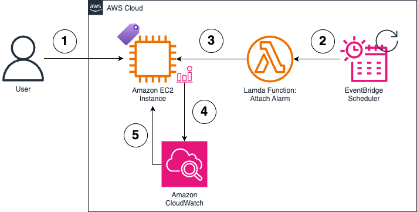

# Stop idle Amazon EC2 Instances automatically

## Overview

Idle Amazon EC2 instances can be stopped to reduce costs. AWS Lambda, Amazon CloudWatch and Amazon EventBridge [can be used](https://aws.amazon.com/blogs/compute/hibernating-ec2-instances-in-response-to-a-cloudwatch-alarm/) to automatically stop idle instances. Previous solutions placed a high burden on the instance owners. Our solution requires one tag to configure an instance. 

<figure>

</figure>

1. User adds tag AutoShutdown = 'true' to the instance
2. Amazon EventBridge Scheduler triggers an AWS Lambda function every 60 min
3. AWS Lambda checks all instances with the AutoShutdown tag. An Amazon CloudWatch alarm triggered on low CPU utilization is added if one is absent. 
4. Amazon CloudWatch monitors instance CPU utilization. 
5. If CPU utilization falls below the threshold for a predefined period of time, instance is stopped.

## Configuring EC2 Instances for automatic shutdown

To configure your Amazon EC2 Instance to automatically hibernate, attach an AutoShutdown tag. If the solution has not been deployed to your account, follow solution setup instructions before proceeding. 

1. Open the Amazon EC2 console.
2. In the navigation pane, choose Instances.
3. Select an instance to tag by clicking the Instance ID
4. Select Tags tab
5. Select Manage tags
6. Add new tag with key AutoShutdown and Value true

> [!WARNING]
> Note that an alarms are added to all tagged instances once every hour

## Deploying the solution

### A. Configure permissions with IAM

1. Open the IAM console.
2. In the navigation pane, choose Policies.
3. Select Create policy.
4. Switch to JSON view in the Policy editor. Paste the following

```JSON
{
    "Version": "2012-10-17",
    "Statement": [
        {
            "Sid": "VisualEditor0",
            "Effect": "Allow",
            "Action": [
                "cloudwatch:PutMetricAlarm",
                "cloudwatch:DescribeAlarms",
                "ec2:DescribeInstances",                
                "logs:CreateLogStream",
                "logs:CreateLogGroup",
                "logs:PutLogEvents"
            ],
            "Resource": "*"
        }
    ]
}
```
5. Name the policy AllowCreateAlarmOnMetricPolicy.
6. In the navigation page, select Roles.
7. Select Create role.
8. For Trusted entity type, select AWS Service.
9. For Use case, select Lambda.
10. Select Next.
11. In the Permissions policies list, search and select AllowCreateAlarmOnMetricPolicy.
12. Select Next.
13. Name the role AllowCreateAlarmOnMetricRole.
14. Select Create role.

> [!WARNING]
> Check that a AWSServiceRoleForCloudWatchEvents service-linked role exists in your account. See documentation for instructions if the role is missing in IAM.

### B. Create the Lambda function

1. Open the Functions page of the Lambda console.
2. Choose Create function.
3. Select Author from scratch.
4. Name the function AttachCloudWatchAlarmFunction.
5. For the Runtime, select Python 3.10 (or the latest Python version).
6. For Architecture, choose arm64.
7. Expand Change default execution role and select Use an existing role.
8. Select AllowCreateAlarmOnMetricRole from the list of existing roles.
9. Select Create function at the bottom of the page.

In the Lambda function page, scroll down to view the Code tab at the bottom. Copy the following code onto the editor for the lambda_function.py file.

```Python
import boto3

#Script parameters
ALARM_NAME = 'Idle-EC2-Instance-LessThan10Pct-CPUUtilization-15Min'
TAG_NAME = 'AutoShutdown'
TAG_VALUES = ['true']
region = 'us-west-2'

def lambda_handler(event, context):
    #Create EC2 Client
    ec2Client = boto3.resource('ec2')

    #Grab all instance ids filtered by tag, ignore terminated or terminating 
    all_instance_ids = []
    for instance in ec2Client.instances.filter(Filters=[{'Name': 'tag:'+TAG_NAME, 'Values': TAG_VALUES}, {'Name': 'instance-state-name', 'Values': ['running','pending','stopping','stopped']}]):
        all_instance_ids.append(instance.id)

    #Create CloudWatch Client
    cloudWatchClient = boto3.client('cloudwatch')
 
    #Grab all instances with alarms attached
    response = cloudWatchClient.describe_alarms()

    #Filter for instances with a specific alarm name
    all_instance_ids_with_alarm = []
    for record in response['MetricAlarms']:
        if ALARM_NAME in record['AlarmName']:
            for instance in record['Dimensions']:
                all_instance_ids_with_alarm.append(instance['Value'])

    #Get all instances with tag that don't have an alarm attached
    tagged_instances_without_an_alarm = set(all_instance_ids) - set(all_instance_ids_with_alarm)

    #Iterate over instances and setup an alarm
    for instance in tagged_instances_without_an_alarm:
        #Configuration parameters for the alarm
        AlarmName = ALARM_NAME+'_'+instance
        AlarmDescription = 'Triggered when CPUUtilization < 10 for 1 consecutive 15 min periods.'
        ActionsEnabled=True
        AlarmActions = ['arn:aws:automate:'+region+':ec2:stop']
        MetricName='CPUUtilization'
        Namespace='AWS/EC2'
        Statistic='Average'
        Dimensions=[{"Name":"InstanceId","Value": instance}]
        Period=900
        EvaluationPeriods=1
        DatapointsToAlarm=1
        Threshold=10
        ComparisonOperator= 'LessThanThreshold'

        cloudWatchClient.put_metric_alarm(AlarmName=AlarmName, AlarmDescription=AlarmDescription, ActionsEnabled=ActionsEnabled, AlarmActions=AlarmActions, MetricName=MetricName, Namespace=Namespace, Statistic=Statistic, Dimensions=Dimensions, Period=Period, EvaluationPeriods=EvaluationPeriods, DatapointsToAlarm=DatapointsToAlarm, Threshold=Threshold, ComparisonOperator=ComparisonOperator)
        print('Added alarm to instance ' + instance)
```
10. On the function overview page, select Add trigger
11. Select EventBridge (CloudWatch Events) as the source
12. Pick Create a new rule for Rule
13. Use TriggerAttachCloudWatchAlarmFunction for rule name
14. Use Schedule expression for rule type
15. Enter rate(1 hour)for Schedule expression
16. Select Add

## Appendix

[Hibernating EC2 Instances in Response to a CloudWatch Alarm | Amazon Web Services](https://aws.amazon.com/blogs/compute/hibernating-ec2-instances-in-response-to-a-cloudwatch-alarm/)


